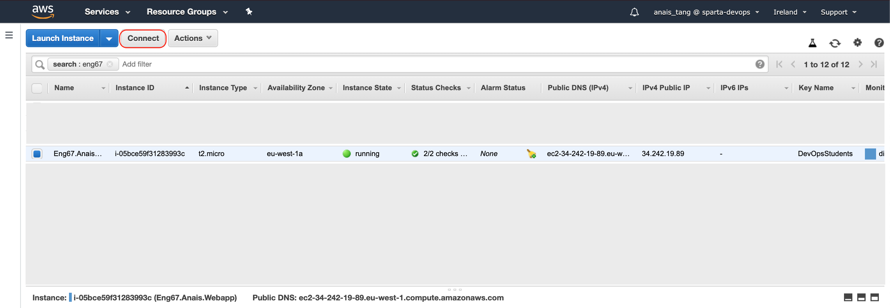

# Running a Node JS Application on AWS EC2 Server 

> Navigate [here](https://github.com/naistangz/Technical_Training/blob/master/docs/Week8_CloudServices/aws.md) for additional information on AWS [TBC]\
> [Creating an Instance](ec2Instance.md)

## Connecting to your Instance
1. From the console dashboard, select Instance, then click on **Connect**

2. Follow the instructions by typing the commands in Terminal or Git Bash:

3. Navigate to the folder 
```bash
cd NodeJSAWS_Deploy_Code
```
4. Connect to your instance using its Public DNS:
```bash
$ ssh -i "DevOpsStudents.pem" ubuntu@ec2-54-247-25-118.eu-west-1.compute.amazonaws.com
```
5. If successful, the commands should return:
```bash
Your app is ready and listening on port 3000
```
6. Enter your Public IP address in the browser.
7. Remember to disconnect from your Instance by navigating to **Instance State** then clicking on **Stop** or **Terminate**

## Adding Security Groups
1. Right click on your instance
2. Navigate to Networking
3. Click on Change Security Groups
4. Select Security Group(s) to associate with your instance

## Connecting to your AWS Linux instance using SSH
## Manual way 
1. In terminal window, use `ssh` command to connect 
`ssh -i /path/my-key-pair.pem my-instance-user-name@my-instance-public-dns-name`

# NOTE
- AWS instance public IP changes, alter `nginx` configuration file to ensure that it runs on correct IP address (setup.sh, provision.sh)

## Error:292
If `events.js:292` error occurs, type the following:
```bash
killall -9 node
```

Then run app again 
```bash
node app.js
```

## Checklist 
 -[x] App is running on port 80
 -[x] Configure vagrant file to get DB VM set up
 -[x] Get `/posts` working 
 -[x] Configure `provision.sh` file so that IP address is updated when AWS changes Public IP using `public
 