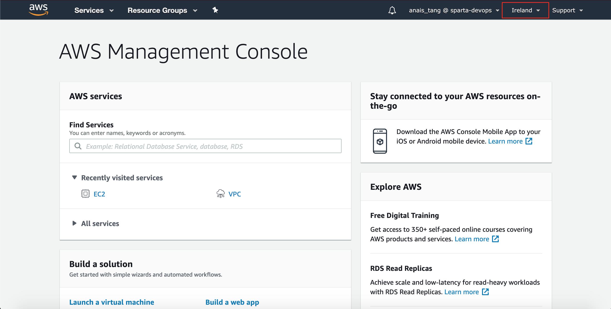
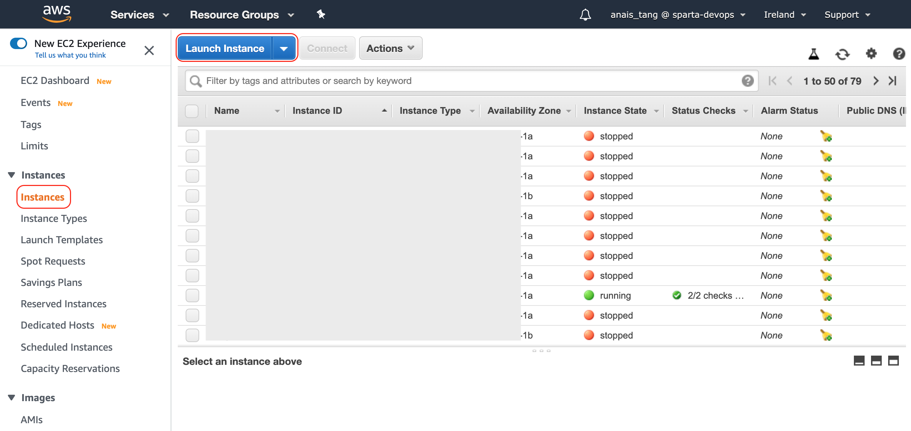
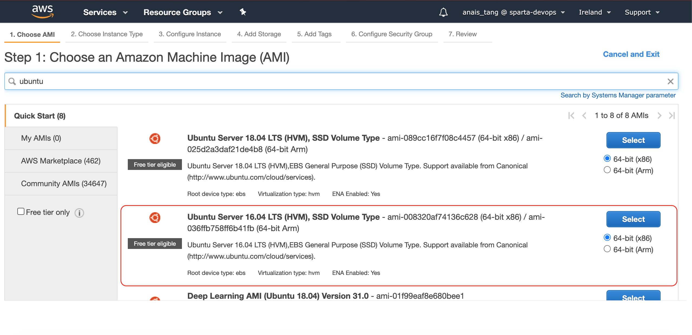
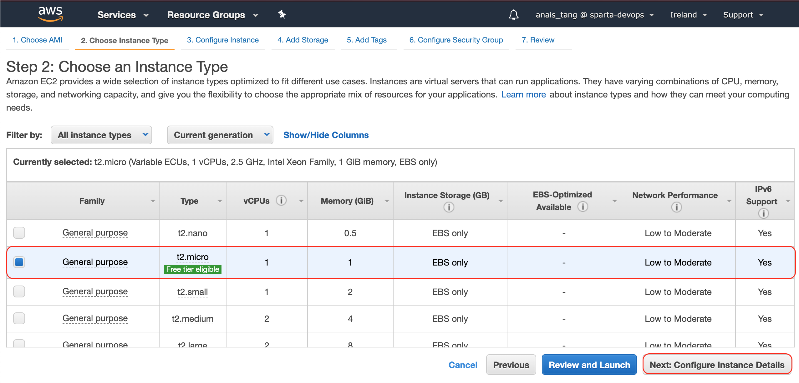
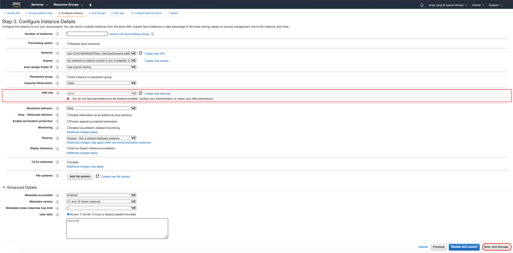
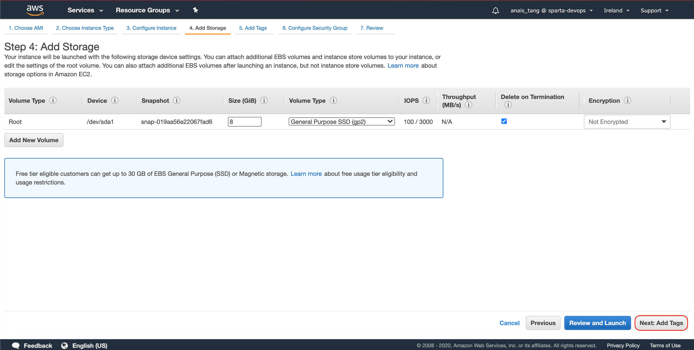
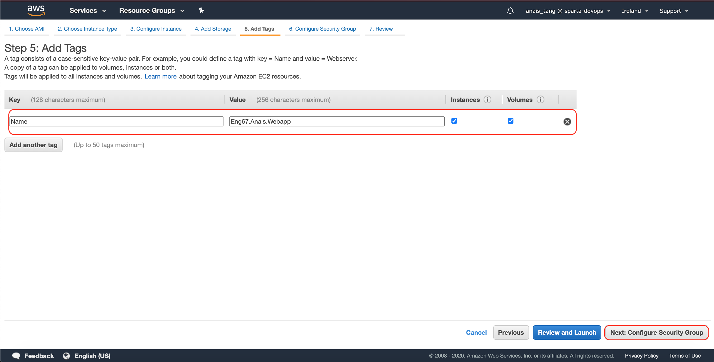
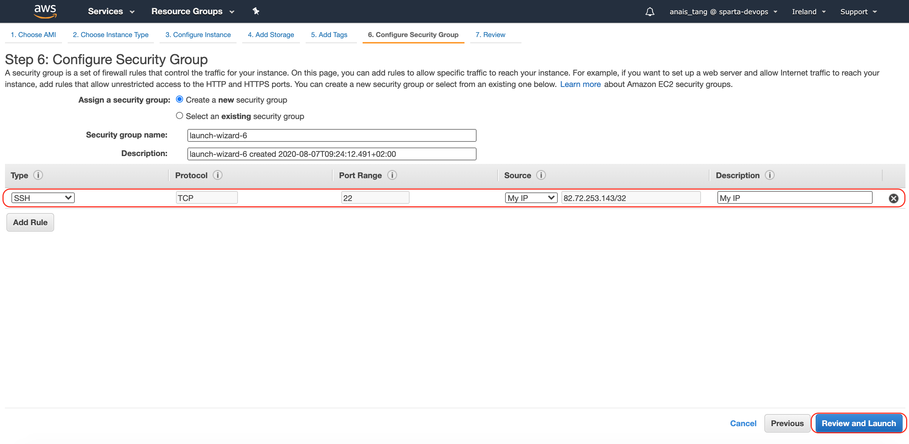
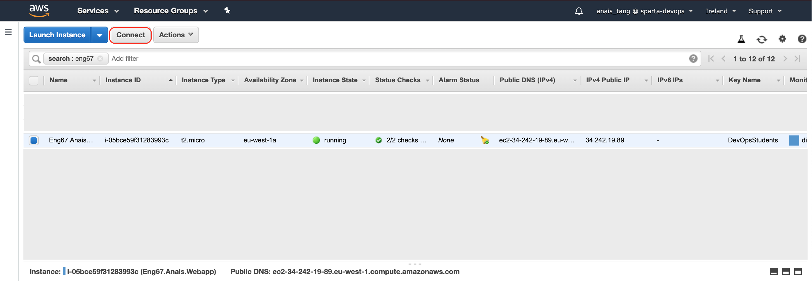
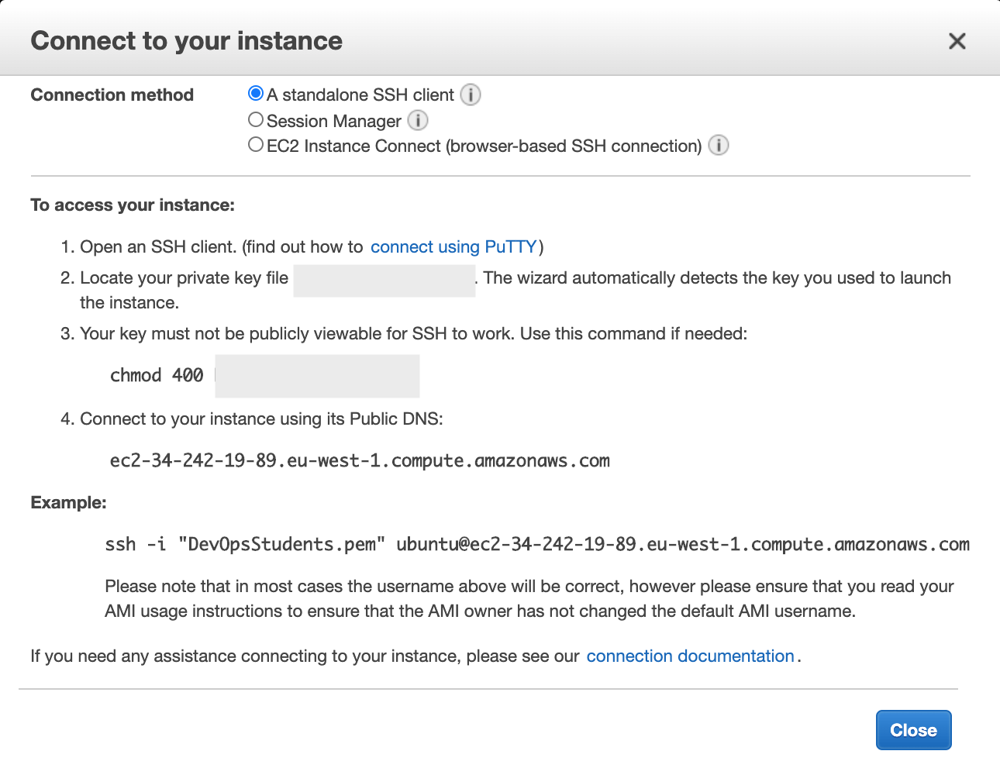

# Creating an Instance 
> [What is an Amazon EC2 instance?](https://github.com/naistangz/Technical_Training/blob/master/docs/Week8_CloudServices/aws.md)

### Tasks
1. Create an AWS account [here](https://aws.amazon.com/)
2. [Launch an Instance](#launch-an-instance)
3. [Connect to Your Instance](#connecting-to-your-instance)
4. [Add Security Groups](#adding-security-groups)

## Launch an Instance
1. Open the [Amazon EC2 Console](https://console.aws.amazon.com/ec2/)
2. Specify the Availability Zone in which you would like your instance to run.


3. From the console dashboard, choose **Launch Instance**



4. The **Choose an Amazon Machine Image (AMI)** page displays a list of basic configurations, called *Amazon Machine Images(AMIs)*, that serve as templates for your instance. Select an instance.


5. Select the hardware configuration. The `t2.micro` instance type is eligible for the free tier.



6. Configure Instance Details 



7. Add storage (selected by default)



8. Add tags with clear descriptions
> [What is a tag?](https://docs.aws.amazon.com/AWSEC2/latest/UserGuide/Using_Tags.html)



9. Configure Security. By default, the wizard has created and selected a security group for you. You can use this security group, or alternatively you can select the security group that you created when getting set up. Then, click **Review Instance Launch**



10. Finally, choose **Launch Instances**


## Connecting to your Instance
1. From the console dashboard, select Instance, then click on **Connect**

2. Follow the instructions by typing the commands in Terminal or Git Bash:

3. Navigate to the folder 
```bash
cd NodeJSAWS_Deploy_Code
```
4. Connect to your instance using its Public DNS:
```bash
$ ssh -i "DevOpsStudents.pem" ubuntu@ec2-54-247-25-118.eu-west-1.compute.amazonaws.com
```
5. If successful, the commands should return:
```bash
Your app is ready and listening on port 3000
```
6. Enter your Public IP address in the browser.
7. Remember to disconnect from your Instance by navigating to **Instance State** then clicking on **Stop** or **Terminate**

## Adding Security Groups
1. Right click on your instance
2. Navigate to Networking
3. Click on Change Security Groups
4. Select Security Group(s) to associate with your instance

## Connecting to your AWS Linux instance using SSH
1. In terminal window, use `ssh` command to connect 
`ssh -i /path/my-key-pair.pem my-instance-user-name@my-instance-public-dns-name`

# NOTE
- AWS instance public IP changes, alter `nginx` configuration file to ensure that it runs on correct IP address (setup.sh, provision.sh)

## Error:292
If `events.js:292` error occurs, type the following:
```bash
killall -9 node
```

Then run app again 
```bash
node app.js
```
